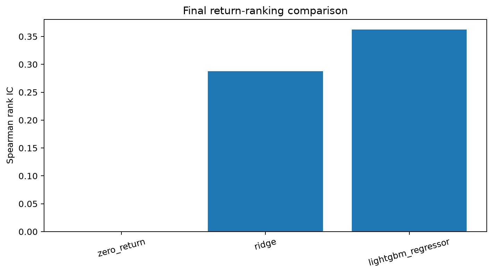
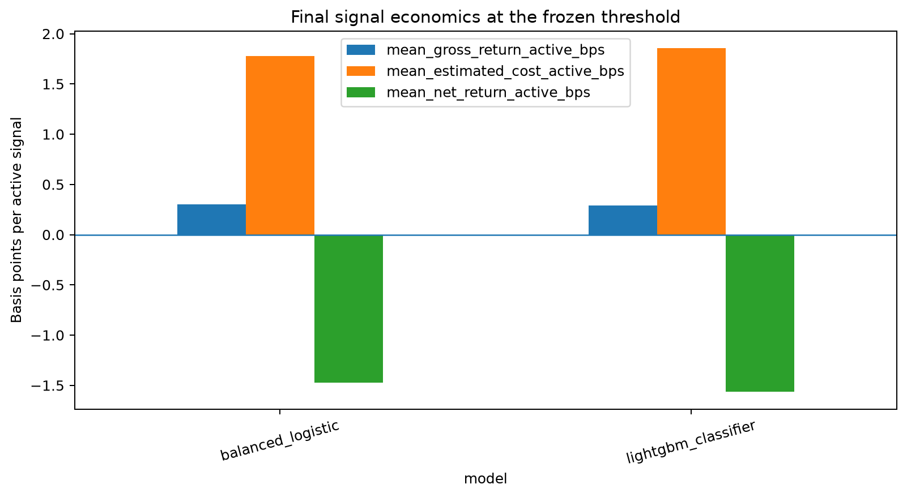

# Nasdaq Order-Book Microstructure Research

A leakage-controlled market-microstructure research pipeline and streaming
Nasdaq TotalView-ITCH 5.0 order-book reconstruction engine implemented in
Python.

## Headline results

- Parsed 368,366,634 market-wide ITCH messages and independently reconstructed
  1,656,597 AAPL displayed-book transitions.
- Maintained order-ID and aggregated price-level state with zero missing
  references, share underflows, timestamp reversals, or crossed/locked snapshots.
- Frozen 50-event LightGBM model achieved 0.363 rank IC, 46.19% balanced
  classification accuracy, and 6.67% MAE improvement over a zero-return baseline.
- Gross signal edge was 0.289 bps per active observation against an estimated
  aggressive execution cost of 1.854 bps.
- The result supports short-horizon price predictability, not a deployable
  aggressive trading strategy.

flowchart LR
    subgraph Prediction research
        A[LOBSTER messages and snapshots] --> B[Schema and transition audit]
        B --> C[35 microstructure features]
        C --> D[Purged walk-forward validation]
        D --> E[Bootstrap and diagnostics]
        E --> F[Regime and cost analysis]
        F --> G[Linear vs LightGBM models]
        G --> H[Frozen holdout evaluation]
    end

    subgraph Market-data engineering
        I[Nasdaq ITCH BinaryFILE] --> J[Streaming binary parser]
        J --> K[Order-ID lifecycle state]
        K --> L[Full-depth price aggregation]
        L --> M[Top-10 snapshots and invariant checks]
    end

## Research question

Does order-flow imbalance contain incremental information about short-horizon mid-price movement after accounting for spread, depth, event intensity, liquidity regime, and simple execution costs?

## Current findings

The initial experiment uses the complete public AAPL 10-level LOBSTER sample for June 21, 2012. Models are evaluated using contiguous purged chronological training, validation, and exploratory-holdout blocks. Rows are never randomly shuffled.

### Classification results on the exploratory holdout

| Horizon | Flat target share | Majority accuracy | Balanced-logistic accuracy | Balanced accuracy | Macro F1 |
|---:|---:|---:|---:|---:|---:|
| 10 events | 38.38% | 38.38% | 38.86% | 33.90% | 20.01% |
| 50 events | 8.39% | 49.53% | 51.52% | 44.04% | 43.07% |
| 100 events | 4.13% | 51.89% | 53.38% | 41.78% | 40.92% |

The 10-event classifier provides little improvement over the majority baseline and remains dominated by the unchanged-price class. The 50-event horizon has the strongest balanced accuracy and macro F1, while the 100-event horizon has the highest raw accuracy. Because class proportions change sharply with the forecast horizon, raw accuracy is not sufficient by itself.

### Regression and execution results on the exploratory holdout

| Horizon | Zero-return MAE (bps) | Ridge MAE (bps) | Ridge rank IC | Non-zero directional accuracy | Gross edge per active signal (bps) | Estimated cost per active signal (bps) | Net edge per active signal (bps) | Break-even quoted-cost fraction |
|---:|---:|---:|---:|---:|---:|---:|---:|---:|
| 10 events | 0.189 | 0.198 | 0.276 | 65.25% | 0.114 | 1.818 | -1.704 | 6.27% |
| 50 events | 0.555 | 0.540 | 0.288 | 62.44% | 0.295 | 1.795 | -1.500 | 16.45% |
| 100 events | 0.878 | 0.867 | 0.247 | 57.87% | 0.389 | 1.825 | -1.438 | 21.36% |

The Ridge model has positive rank information at all three horizons. The 50-event horizon produces the strongest rank IC and improves MAE over the zero-return baseline. At 10 events, Ridge improves RMSE and ranking but does not improve MAE, showing why multiple metrics and naive baselines are necessary.

Gross edge per active signal rises with the prediction horizon, but estimated spread costs remain much larger than the forecast edge. Even at 100 events, the signal would break even only if realised execution costs were approximately 21% of the quoted aggressive-crossing estimate.

The current evidence therefore supports a limited conclusion:

> Order-book and order-flow features contain short-horizon predictive information, but the baseline signal is not economically executable under aggressive quoted-spread assumptions.

These results should not be interpreted as evidence of a deployable trading strategy. They are based on one stock and one trading day. The final block is an intraday exploratory holdout, not an untouched final test or evidence of out-of-day and cross-asset generalisation.

## Methodological grounding

This is an independent research project that applies methods developed through MSc Financial Engineering training:

- **Financial data engineering:** explicit schemas, fixed-point price conversion, missing-level handling, transformation, feature construction, and reproducible data-quality checks.
- **Financial econometrics:** return targets, correlation-based signal evaluation, chronological dependence controls, volatility features, and planned residual and bootstrap diagnostics.
- **Machine learning in finance:** regularised linear models, class imbalance handling, training-only preprocessing, purged validation, and comparison against defensible naive baselines.
- **Risk management:** gross-versus-net attribution, quoted-spread cost stress, break-even execution analysis, drawdown, and planned VaR and expected-shortfall diagnostics.
- **Model-risk discipline:** failure analysis and explicit separation between statistical predictability and executable alpha.

Deep-learning sequence models are deliberately deferred until more dates or raw ITCH samples provide enough independent training and validation data.

## Initial data path

The first reproducible experiment uses the public AAPL LOBSTER sample:

- date: 2012-06-21;
- session: 09:30:00-16:00:00;
- depth: 10 occupied price levels;
- two row-aligned, headerless CSV files:
  - message events;
  - order-book snapshots after each event.

The raw files are downloaded from a public Hugging Face mirror. They are not committed to Git.

## What the repository builds

1. Raw-file ingestion with explicit schemas and fixed-point price conversion.
2. Message/snapshot row-alignment and quality checks.
3. A one-step limited-depth price-level reconstruction audit.
4. Event-level order-book and order-flow features.
5. Future mid-price classification and regression targets at 10, 50, and 100 event horizons.
6. Purged chronological training, validation, and exploratory-holdout blocks.
7. Majority and class-balanced logistic classification baselines.
8. Zero-return and Ridge regression baselines.
9. Statistical and spread-aware economic evaluation.
10. Reproducible JSON metrics, model artefacts, tests, and research documentation.

Planned additions include walk-forward validation, dependence-aware inference, spread/liquidity/time-of-day regime analysis, cost stress testing, LightGBM comparison, feature-family ablation, a chart pack, and a short research note.

## Important terminology

LOBSTER already reconstructs the order-book snapshots from NASDAQ ITCH. In the LOBSTER phase, this repository:

- validates message-to-snapshot transitions;
- reconstructs a limited price-level state from the supplied event stream;
- engineers predictive features from aligned messages and snapshots.

A true full-depth reconstruction from raw binary ITCH is a separate later phase.

## Repository structure

```text
configs/                    Experiment settings
data/                       Local-only raw and processed data
docs/                       Research design and report outline
models/                     Generated model artefacts
notebooks/                  Auditable exploration
reports/figures/            Generated charts
reports/tables/             Metrics and diagnostics
scripts/                    Windows PowerShell entry points
src/orderbook_research/     Reusable pipeline code
tests/                      Synthetic unit tests
```

## Windows setup

```powershell
Set-ExecutionPolicy -Scope Process -ExecutionPolicy Bypass
.\scripts\setup.ps1
.venv\Scripts\Activate.ps1
```

## Download the public AAPL sample

```powershell
.\scripts\download_lobster.ps1
```

Expected local files:

```text
data/raw/lobster/AAPL_10/
AAPL_2012-06-21_34200000_57600000_message_10.csv
AAPL_2012-06-21_34200000_57600000_orderbook_10.csv
```

No Kaggle account, API key, or Hugging Face account is required for the public repository.

## Run Phase 0 checks

```powershell
python -m orderbook_research.audit --levels 10 --max-rows 100000
pytest
python -m orderbook_research.smoke_test
```

The audit writes:

```text
reports/tables/data_audit.json
```

## Reproduce all baseline experiments

Run all three event horizons with the same model and evaluation configuration:

```powershell
.\scripts\run_all_baselines.ps1
```

The script generates:

```text
reports/tables/baseline_h10_metrics.json
reports/tables/baseline_h50_metrics.json
reports/tables/baseline_h100_metrics.json
```

A single horizon can also be run directly:

```powershell
python -m orderbook_research.train_baseline `
    --ticker AAPL `
    --levels 10 `
    --horizon 50
```




## Leakage controls

- Rows are never randomly shuffled before splitting.
- Splits are contiguous in event time.
- A purge gap of at least the maximum target horizon separates adjacent blocks.
- Imputers and scalers are fitted using training observations only.
- Future mid-price values are used only for target construction and evaluation.
- Rolling features use current and past observable events only.
- The final block is described as an exploratory holdout because it has been inspected during model development.
- Stronger claims are deferred until purged walk-forward and multi-day evaluation are available.

## One-day limitation

The public sample provides one date. Chronological intraday evaluation controls leakage but does not establish day-to-day stability. Stronger validation requires additional dates from licensed LOBSTER data or reconstructed official ITCH samples.

## Data and licensing

This repository contains code and lightweight derived metrics only. Review the source dataset's terms before redistributing data. Do not commit the raw CSV files. Publish code, aggregate metrics, figures, and executed notebook outputs; do not publish raw or event-level market data.