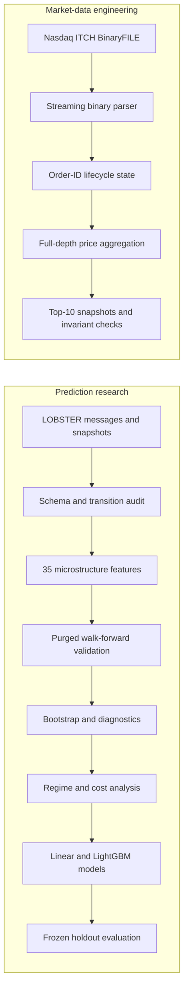
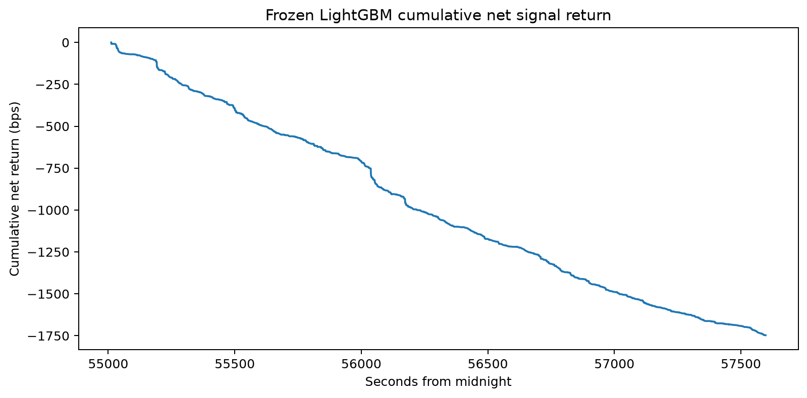

# Nasdaq Order-Book Microstructure Research

A Python research and market-data engineering project that combines:

- leakage-controlled short-horizon price prediction using LOBSTER order-book data;
- streaming Nasdaq TotalView-ITCH 5.0 binary parsing;
- independent order-ID-level book reconstruction;
- cost-aware evaluation that separates statistical predictability from executable alpha.

## Headline results

- Parsed **368,366,634** market-wide ITCH messages from the official January 30,
  2019 sample.
- Independently reconstructed **1,656,597 AAPL displayed-book transitions** while
  maintaining order-ID state and aggregated bid/ask price levels.
- Recorded **zero** missing order references, duplicate references, share
  underflows, timestamp reversals, or crossed/locked exported snapshots.
- A frozen 50-event LightGBM model achieved **0.363 rank IC**, **46.19% balanced
  accuracy**, and **6.67% lower MAE** than a zero-return baseline on the final
  configuration-level holdout.
- The frozen signal produced **0.289 bps gross edge** per active observation
  against **1.854 bps estimated aggressive execution cost**.

The central conclusion is deliberately limited:

> Order-book state and event-flow features contain short-horizon predictive
> information, but the measured edge does not support repeated aggressive
> spread-crossing execution.

## Architecture



## Interactive research website

The repository includes a research-oriented Next.js application in [`web/`](web/)
with six public views:

- a result-led project overview;
- a synthetic order-book lifecycle replay;
- a 31-feature prediction lab using browser-side LightGBM tree inference;
- a walk-forward and feature-ablation explorer;
- an execution-cost sensitivity lab;
- an ITCH engineering and invariant dashboard.

The site deploys no raw LOBSTER or Nasdaq rows and does not require a Python
server. Scenario controls generate a deterministic 150-event synthetic history,
derive the frozen feature vector, and run the verified classifier and regressor
locally in the browser. The prediction page is explicitly an educational model
response, not a live forecast or trading recommendation.


## Research question

Does recent order flow contain incremental information about mid-price movement
over the next 10, 50, or 100 events after accounting for spread, displayed
liquidity, volatility, event intensity, and simple execution costs?

## Data

### Predictive study

The modelling experiment uses the public AAPL 10-level LOBSTER sample for
June 21, 2012:

- regular session: 09:30:00 to 16:00:00;
- 400,391 aligned message and order-book rows;
- forecast horizons: 10, 50, and 100 events;
- 35 event-level and order-book features.

LOBSTER supplies reconstructed displayed-book snapshots. The project validates
message-to-snapshot transitions and uses those aligned rows for predictive
research.

### Independent reconstruction study

The engineering extension uses the official January 30, 2019 Nasdaq
TotalView-ITCH 5.0 sample. The parser streams the compressed BinaryFILE and
maintains individual order references plus aggregated price levels for AAPL.

Raw data and large reconstructed outputs are intentionally excluded from Git.
See [Data and licensing](docs/DATA_LICENSE.md).

## Validation design

The research pipeline uses:

- chronological splits only;
- no random shuffling;
- a 100-event purge between adjacent blocks;
- training-only preprocessing;
- five expanding walk-forward folds inside the first 80% of the day;
- moving-block bootstrap intervals;
- a candidate frozen before the final 20% configuration-level holdout;
- non-overlapping signal observations for economic analysis.

The final block had previously been viewed using exploratory linear baselines,
but it was not used to select the frozen LightGBM no-time candidate. It is
therefore described as a **configuration-level holdout**, not a completely
untouched independent test.

## Final predictive results

The selected model uses a 50-event horizon and 31 features, excluding explicit
clock-time variables.

| Model | Balanced accuracy | Macro F1 | MAE (bps) | MAE improvement vs zero | Rank IC | Non-zero directional accuracy |
|---|---:|---:|---:|---:|---:|---:|
| Balanced logistic / Ridge | 43.20% | 0.392 | 0.541 | +2.35% | 0.288 | 63.03% |
| LightGBM | **46.19%** | **0.456** | **0.518** | **+6.67%** | **0.363** | **65.29%** |

Feature-family ablation showed that event-flow features were essential. At the
50-event horizon, removing order-flow and event-pressure features reduced rank
IC from 0.266 to 0.048 and reduced gross edge from 0.182 bps to 0.010 bps.
Removing explicit time features improved the development-fold average, which
suggests that raw clock-time variables encouraged unstable intraday shortcuts.

Detailed fold, bootstrap, diagnostic, regime, and ablation results are in
[docs/RESULTS.md](docs/RESULTS.md).

## Execution result

At the frozen 0.10 confidence threshold:

| Model | Active fraction | Gross edge per active signal | Estimated cost per active signal | Net edge per active signal | Break-even cost fraction |
|---|---:|---:|---:|---:|---:|
| Balanced logistic | 54.22% | 0.303 bps | 1.776 bps | -1.472 bps | 17.08% |
| LightGBM | 69.83% | 0.289 bps | 1.854 bps | -1.564 bps | 15.62% |

The statistical model is useful for studying price formation, but the forecast
magnitude is far below the assumed aggressive crossing cost. The repository
therefore does not present the result as a deployable strategy.

## Final figures

### Return-ranking performance


### Gross edge versus estimated execution cost


### Net result after estimated costs



## Raw ITCH reconstruction results

| Metric | Result |
|---|---:|
| Market-wide records processed | 368,366,634 |
| Binary payload processed | 10.51 GB |
| AAPL displayed-book transitions | 1,656,597 |
| Maximum simultaneous AAPL orders | 42,774 |
| Missing order references | 0 |
| Duplicate order references | 0 |
| Share underflows | 0 |
| Timestamp reversals | 0 |
| Crossed or locked snapshots | 0 |
| Final open orders | 0 |
| Processing throughput | 40,470 records/second |
| Python-tracked peak allocation | 303.6 MB |

The complete compressed session was consumed to clean gzip EOF without
truncated records, payload-length mismatches, or decompression errors. The
sample did not expose a zero-length BinaryFILE terminator.

Phase E is an independent market-data engineering benchmark. It was not used to
claim that the 2012 predictive model generalises to the 2019 session.

## Supported ITCH order lifecycle

The reconstruction engine handles:

- `A` and `F`: add order;
- `E` and `C`: visible execution;
- `X`: partial cancellation;
- `D`: deletion;
- `U`: cancel-replace.

Replace messages are processed atomically while retaining the old and new order
references, sizes, and prices. Non-displayed `P` trades are counted but do not
modify the displayed book.

## Repository structure

```text
.github/workflows/          Continuous integration
configs/                    Reproducible experiment settings
data/                       Local-only raw and processed data
docs/                      Design, results, protocols, and reproducibility
notebooks/                  Executed research notebooks
reports/figures/final/      Publication figures
reports/tables/             Aggregate metrics and diagnostics
scripts/                    PowerShell entry points and web export tools
src/orderbook_research/     Reusable research and reconstruction code
tests/                      Synthetic and integration tests
web/                        Next.js interactive research website
```

## Setup on Windows

Python 3.11 or newer is required.

```powershell
Set-ExecutionPolicy -Scope Process -ExecutionPolicy Bypass
.\scripts\setup.ps1
.venv\Scripts\Activate.ps1
```

Run quality checks:

```powershell
python -m ruff check src tests
python -m ruff format --check src tests
pytest
```

The complete local environment runs 49 tests when PyArrow is installed. The
real-Parquet test is skipped when PyArrow is unavailable.

## Run the interactive website locally

The aggregate site works immediately. To enable genuine browser inference, keep
the two ignored Phase D joblib files and the local LOBSTER sample available, then
run:

```powershell
.\scripts\setup_web_export.ps1
.\scripts\run_web.ps1
```

The export step exports the frozen LightGBM pair as compact tree JSON and verifies prediction
parity on development rows, profiles development-only feature ranges, and builds
the website. Open `http://localhost:3000`.

For Vercel, import this repository and set the project root directory to `web`.
Set `NEXT_PUBLIC_SITE_URL` to the deployed URL.

## Reproduce the predictive pipeline

Download the public LOBSTER sample:

```powershell
.\scripts\download_lobster.ps1
```

Run the stages:

```powershell
.\scripts\run_phase0.ps1
.\scripts\run_all_baselines.ps1
.\scripts\run_walk_forward.ps1
.\scripts\run_bootstrap.ps1
.\scripts\run_diagnostics.ps1
.\scripts\run_phase_b.ps1
.\scripts\run_phase_c.ps1
```

The frozen holdout protocol and execution instructions are documented in
[docs/FINAL_EVALUATION_PROTOCOL.md](docs/FINAL_EVALUATION_PROTOCOL.md). The
runner intentionally prevents accidental repeated final evaluations unless an
explicit override is provided.

## Reproduce the ITCH reconstruction

Run the synthetic smoke test first:

```powershell
.\scripts\run_phase_e.ps1 -Smoke
```

Download the large official sample:

```powershell
.\scripts\download_itch_sample.ps1 -ConfirmLargeDownload
```

Run a limited reconstruction before processing the complete session:

```powershell
.\scripts\run_phase_e.ps1 `
    -InputPath "data\raw\itch\01302019.NASDAQ_ITCH50.gz" `
    -Symbol AAPL `
    -Levels 10 `
    -StopAfterTargetEvents 250000
```

Full protocol details are in
[docs/ITCH_RECONSTRUCTION_PROTOCOL.md](docs/ITCH_RECONSTRUCTION_PROTOCOL.md).

## Limitations

- The predictive study uses one stock and one trading day.
- The final block is a configuration-level holdout, not an independent day.
- The execution model assumes immediate aggressive fills and omits latency,
  queue position, partial fills, fees, market impact, and capacity.
- Gain importance is descriptive and not causal.
- The raw ITCH reconstruction validates engineering correctness but does not
  provide cross-day model validation.

## Documentation

- [Research design](docs/RESEARCH_DESIGN.md)
- [Consolidated results](docs/RESULTS.md)
- [Reproducibility guide](docs/REPRODUCIBILITY.md)
- [Final evaluation protocol](docs/FINAL_EVALUATION_PROTOCOL.md)
- [ITCH reconstruction protocol](docs/ITCH_RECONSTRUCTION_PROTOCOL.md)
- [Data schema](docs/DATA_SCHEMA.md)
- [Implementation history](docs/IMPLEMENTATION_HISTORY.md)
- [Final research note](reports/final_research_note.md)
- [Interactive website](docs/WEB_DEMO.md)
- [Release notes](docs/RELEASE_NOTES_v1.0.0.md)

## Licence

The source code is released under the MIT License. Market data remains subject
to the terms of its original provider. The repository does not grant rights to
Nasdaq or LOBSTER data.
